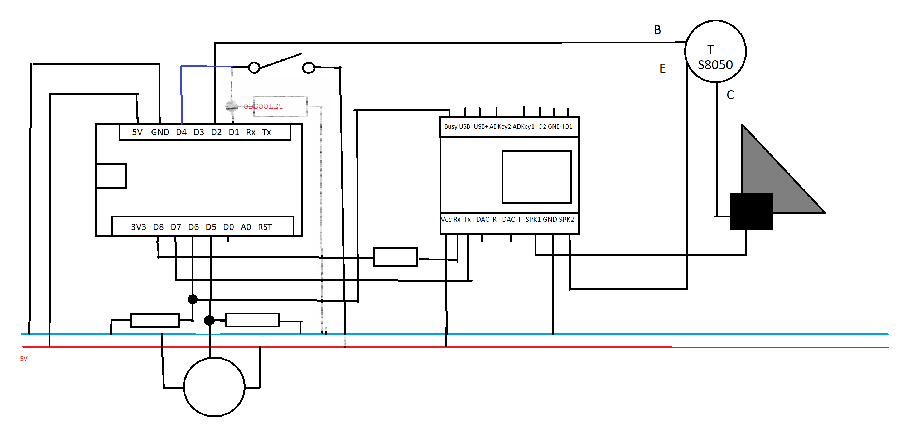

# time-teller
Tells you what time it approximately is without the need to look at a blinding screen at night.

The [Arduino code](./c++/arduino/time-teller/) is fully functional and can be run on a D1 Mini ESP8266 chip with some periphery
attached like in this wiring diagram:

Make sure to keep the D8 pin on the D1 Mini flexibly disconnectable as it needs to be disconnected when uploading updated code.
Before uploading the code, update your [WIFI info](./c++/arduino/time-teller/wifi.ino).
